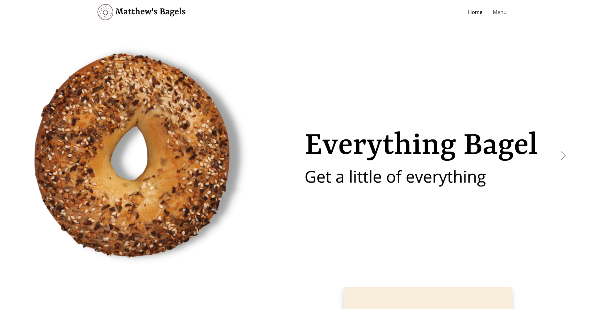
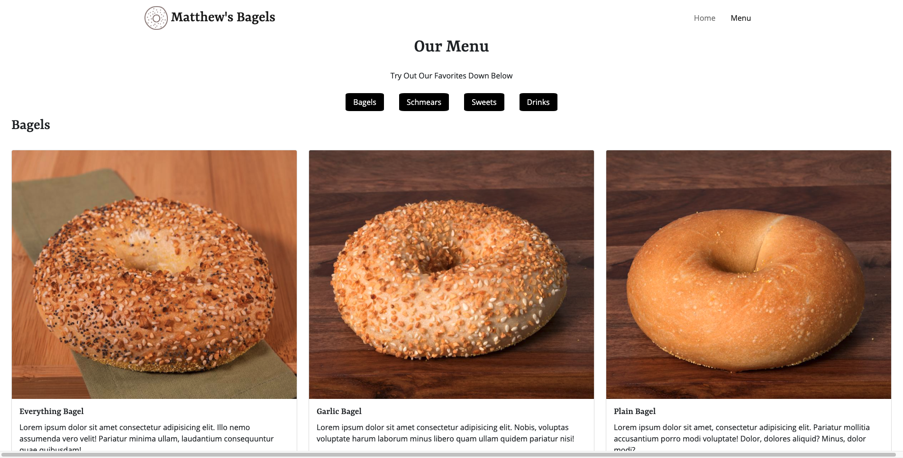

# Matthew's Bagels

## Description
A bagel website using HTML, CSS, and Bootstrap.

#### WORK IN PROGRESS
* Plans to fix the menu nav on mobile.

## How to Use
1. Goto the Github Pages I currently have Matthew's Bagels on [here](https://matthewwei35.github.io/matthews-bagels/).
2. You can view the Home and Menu page by going to the navbar found at the top.

## Screenshots

